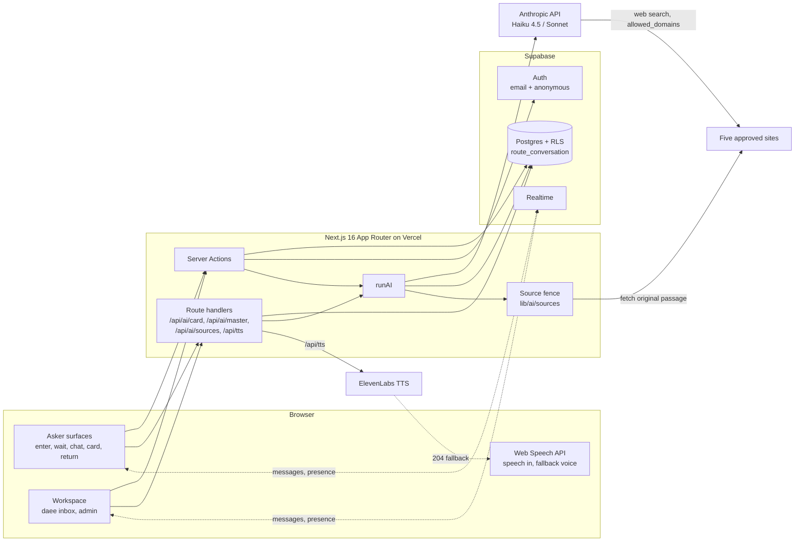

# Wasl (وصل)

Wasl keeps a text dialogue between an asker and a human داعية continuous across sessions and hand-offs.
The asker writes a question, is routed to a داعية who speaks their language, and can carry an approved card of their own selected messages to the next داعية.
AI only clarifies, classifies, drafts and finds verbatim readings; it never dialogues on religion, and every feature has a manual path.

Live: https://wasl-swart-pi.vercel.app

Entry for the Islamic AI Challenge 2026, track 3. Project rules and fixed product limits: [CLAUDE.md](CLAUDE.md).

## Demo accounts

Created by `npm run seed` (`scripts/seed.ts`). The password is the `DEMO_PASSWORD` you set; it is not in the repo.

| Email | Role | Name | Languages | Status |
| --- | --- | --- | --- | --- |
| admin@wasl.demo | admin | Demo Admin | ar, en | |
| daee1@wasl.demo | daee | خالد | ar, en | available |
| daee2@wasl.demo | daee | سارة | en, fr, tl | busy |
| daee3@wasl.demo | daee | يوسف | es, ar, ur, id | offline |

After `npm run seed:demo` there are also two askers: a returning Arabic asker **سالم** and an English asker **Noura**.

To try the returning journey, open "Return" and enter **سالم** with the synthetic return code `QRAN-7SM3-K4`. سالم has two ended sessions with خالد about the Quran and an approved AI master card; Noura is waiting with a question about prayer, with readings cached.

Order: `npm run demo:reset -- --yes`, `npm run seed`, `npm run seed:demo`.

Askers need no account: they enter from the home page (anonymous session, pseudonym and return code).

## Architecture



- Every model call goes through `runAI` (`lib/ai/runAI.ts`): org switch (`organizations.ai_enabled`), per-task rate limit, model by tier, user text in delimited data blocks, a 12 s timeout (30 s for `find_sources`), one retry on a schema failure, `postValidate`, a policy check on model-written text, a row in `ai_runs`, and `{ ok: false, fallback: true, reason }` on any failure (plus an `ai_fallback` event).
- Routing is not AI: the Postgres function `route_conversation` (migration `0010_explainable_routing.sql`) picks an available daee who speaks the asker's language and has capacity, topic match first, then fewest open conversations, then longest since last assignment. It stores `match_quality` (full, partial, none) and the reasons.
- `/api/tts` proxies ElevenLabs on the server (key never reaches the browser). With no key or any error it returns 204 with `X-TTS-Path: fallback` and the browser speaks with Web Speech.

## AI features

Models come from env: `ANTHROPIC_MODEL_FAST` (`.env.example`: `claude-haiku-4-5-20251001`) and `ANTHROPIC_MODEL_CARD` (`.env.example`: `claude-sonnet-5-5`). There is no default in code; unset means fallback `not_configured`.

Calls use the Vercel AI SDK `generateText` / `streamText` with `Output.object({ schema })` (a zod schema), except `find_sources`, which calls the Messages API directly. Policy check (`lib/ai/policy.ts`): a model-authored output containing a ruling or citation marker (يجوز, حرام, حلال, قال تعالى, قال رسول الله, "the prophet said", "fatwa:", …) is discarded with reason `policy`.

| Task (`lib/ai/tasks/`) | Tier | What it does and how | Manual fallback | Never |
| --- | --- | --- | --- | --- |
| `intake` (the guide) | fast | Up to 3 short clarifying questions, then a summary (question, topic, depth, level a–d). `postValidate` caps at 3 questions under 20 words, rejects questions about the person (regex), forces level d for a personal ruling. | The plain question box. | Answers a religious question (sets `refusedReligiousQuestion` and the app says a داعية will answer), asks about belief, religion, background or conviction. |
| `classify` | fast | Topic (7 values), language, depth, confidence for routing. Below 0.5 confidence the topic becomes `general`. Cached 60 min per input. | The asker's topic chip; with neither, `general`. A chip always wins over the AI. | Sees the asker's background; labels the person; answers. |
| `card` | card | Drafts the four card fields from the messages the asker selected, each with source message ids. `postValidate` drops ids outside the selection; a field with no valid source becomes "غير محدد"; caps length. Streamed via `/api/ai/card`. | The asker writes the card by hand. | Uses unselected messages; guesses; adds rulings, verses or hadith. Field text is redacted in `ai_runs`. |
| `merge_master` | card | Merges the asker's approved session cards into a master card; sources are session card ids, same `postValidate`. Via `/api/ai/master`. | Manual master card. | Adds anything not in the approved cards. |
| `plan_queries` | fast | 2 or 3 short concept queries (≤ 8 words) for the approved sources from the need and the last 6 messages. Policy check runs on the queries. | The need itself (first 120 characters) is the query. | Writes an answer or a ruling. |
| `find_sources` | fast | Anthropic web search (`web_search_20250305`) restricted to the five approved domains; keeps only citation blocks (`url`, `title`, `cited_text`) and discards the model's prose. `postValidate` applies the source fence, dedupes, puts the preferred source first, keeps ≤ 3 passages ≤ 600 characters, verbatim. Passages are then extended to the original page text (`lib/ai/sources/fetch.ts`) and fenced again. | Human-verified library items for the topic and locale (also the AI-off path). | Shows model-written text; paraphrases; returns anything to an asker at level c or d. |
| `assist_tone` | fast | Labels how the asker's last messages read for the daee: hurried, confused, frustrated, neutral or undefined (fewer than 3 words: always undefined). | Hidden. | Describes the person. Output is never stored (not even redacted) and never reaches the admin. |

Readings order (`lib/sources/readings.ts`): readings already found for the same normalized need, then a live search, then human-verified items. Greetings, thanks and repeats never trigger a search. Approved domains and rules: [docs/sources.md](docs/sources.md).

## Setup from a clean clone

Needs Node 20+, a Supabase project and the Supabase CLI (a dev dependency).

```bash
npm ci
cp .env.example .env.local        # then fill in the values
npx supabase link --project-ref <your-project-ref>
npx supabase db push              # applies supabase/migrations/*.sql
npm run seed                      # org, four staff accounts, slots (needs DEMO_PASSWORD)
npm run library:seed              # human-verified readings from wasl_reading_library.csv
npm run seed:demo                 # demo askers سالم and Noura
npm run dev
```

`npm run demo:reset -- --yes` wipes all asker data and keeps the organization and staff.

## Environment variables

Names only. Never commit values.

| Name | Used for |
| --- | --- |
| `NEXT_PUBLIC_SUPABASE_URL` | Supabase project URL |
| `NEXT_PUBLIC_SUPABASE_ANON_KEY` | Supabase anon key (browser and server) |
| `SUPABASE_SERVICE_ROLE_KEY` | Server-only: seed, `ai_runs` / `events` logging, KPI aggregation |
| `ANTHROPIC_API_KEY` | Server-only model calls |
| `ANTHROPIC_MODEL_FAST` | Fast tier model id |
| `ANTHROPIC_MODEL_CARD` | Card tier model id |
| `ELEVENLABS_API_KEY` | Optional; without it TTS falls back to Web Speech |
| `ELEVENLABS_VOICE_ID` | Optional; default is a premade voice |
| `ELEVENLABS_MODEL_ID` | Optional; default `eleven_multilingual_v2` |
| `DEMO_PASSWORD` | Password for the seeded staff accounts (seed and test scripts) |
| `VERCEL_PROJECT_PRODUCTION_URL` | Set by Vercel; absolute URLs for metadata |

Test-only: `VERIFY_BASE`, `TIMEOUT_BASE`, `LIVE_BASE`, `AI_TEST_TIMEOUT_MS` (never set in production), and `NEXT_PUBLIC_SUPABASE_PUBLISHABLE_KEY` (alternative key name read by `scripts/dev/landing.mjs`).

## Tests and evals

```bash
npx tsc --noEmit          # types
npm run lint              # eslint + logical-properties check
npm run evals             # all evals (card, classify, sources, assist); calls Anthropic
npm run evals:classify    # 20 labeled questions + 3 injections
npm run evals:sources     # deterministic fence rules, then live search on the approved sites
npm run evals:assist      # needs filter, passage extension, tone storage, query planning
```

End-to-end scripts in `scripts/dev/*.mjs` drive a running build with Playwright against the database in `.env.local`:

```bash
npm run build && npx next start -p 3127
node --env-file=.env.local scripts/dev/journey.mjs
```

Every suite, what it covers and the latest results: [docs/TESTING.md](docs/TESTING.md).

## License

See [LICENSE](LICENSE). Third-party services, dependencies and credits: [docs/sources.md](docs/sources.md).
